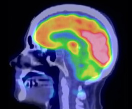
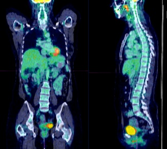
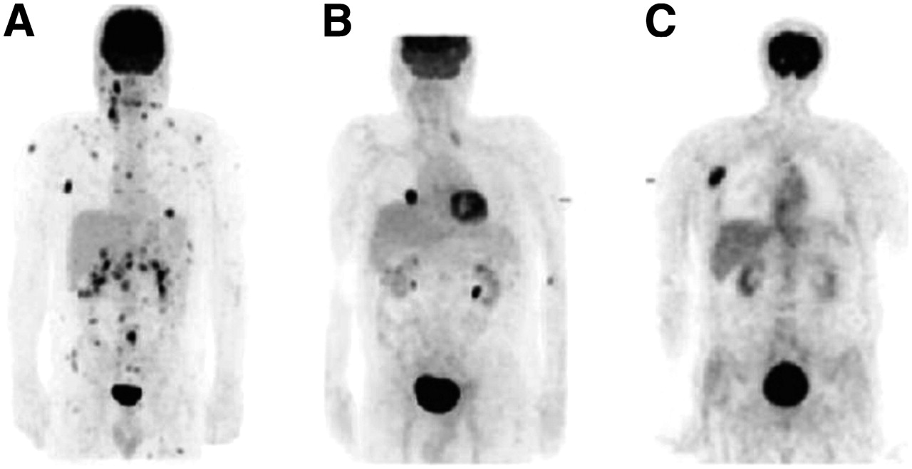
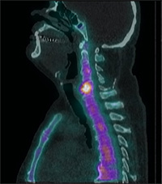

#### Mentorías 2019
### *Facilitador:* P. Pérez

# Herramientas de Data Science para dosimetría en medicina nuclear

## Motivación

Las imágenes de diagnóstico en medicina nuclear se producen por medio de la detección de los rayos x emitidos por radionucleidos incorporados al cuerpo. Estos radionucleidos son adheridos a moléculas llamadas carrier que transportan el elemento radiactivo a las zonas de interés para las cuales fueron diseñadas. Así, por ejemplo, hay moléculas carrier que se dirigen a zonas donde hay mayor concentración de glucosa. Estos radionucleidos se utilizan para dos propósitos generales: diagnóstico y tratamiento de diferentes patologías, entre ellas el cáncer.

La distribución de los radionucleidos en el cuerpo humano depende de varios factores, principalmente del metabolismo del paciente y de la molécula carrier. Por sus propias características, esta distribución no es homogénea ni tampoco se concentra completamente en la zona del cuerpo a la que se desea irradiar, e incluso varía en función del tiempo. Así por ejemplo, podremos encontrar un radionucleído concentrado en una zona tumoral, en una relación 4:1 con su concentración en el resto del cuerpo.

Esta técnica y sus aplicaciones, se encuentran en constante expansión y son cada día más utilizadas en pacientes de todo tipo de edades y características. Las energías de los rayos x de radionucleidos utilizados tradicionalmente para diagnóstico, no revisten mayores peligros para el paciente si es utilizada para estudios ocasionales. Pero la utilización de estos rayos para tratamiento (mayor energía y otras partículas como electrones o partículas alfa) o en controles de rutina periódicos puede implicar grandes depósitos de dosis en el cuerpo del paciente, pudiendo provocar consecuencias indeseables en órganos o tejidos más sensibles y que no necesitan ser tratados. Por esto, la dosimetría en medicina nuclear, constituye hoy una herramienta fundamental para conocer la energía impartida a cada órgano/tejido y poder así evaluar riesgos.

El presente proyecto propone el uso del análisis de clusters para aplicaciones en dosimetría 3D como método de automatización para la identificación de inhomogeneidades. Se asociarán vóxeles a volúmenes de interés de acuerdo a sus propiedades funcionales y se utilizarán técnicas de clustering para ello, pudiendo luego determinar mapas de actividad acumulada necesarios para realiza cálculos de dosimetría 2D y 3D.

### Bibliografía introductoria

1. [The changing face of cancer diagnosis: From computational image analysis to systems biology](https://link.springer.com/content/pdf/10.1007%2Fs00330-018-5347-9.pdf). European Radiology (2018) 28:3160–3164.
2. [Machine Learning in Nuclear Medicine: Part 1—Introduction](http://jnm.snmjournals.org/content/60/4/451.full.pdf+html). Journal of Nuclear Medicine (2019) 60:451–458.
3. [Implementation of cluster analysis in 3D dosimetry for targeted radionuclide therapy](https://www.researchgate.net/profile/Manuel_Bardies/publication/241157459_Implementation_of_cluster_analysis_in_3D_dosimetry_for_targeted_radionuclide_therapy/links/5bf67e72a6fdcc3a8de8f64d/Implementation-of-cluster-analysis-in-3D-dosimetry-for-targeted-radionuclide-therapy.pdf). 2008 IEEE Nuclear Science Symposium Conference Record.

## Descripción del problema

Es necesaria la estimación de distribuciones espaciales de dosis usando aproximaciones 3D basadas en vóxeles. Es necesario un análisis de clusters para aplicaciones de dosimetría 3D que automatice la forma de identificar inhomogeneidades por medio del agrupamiento de los vóxeles dentro del volumen de interés de acuerdo a su funcionalidad.

Se implementará, en un comienzo, la metodología de k-means y se aplicará a imágenes 3D y 4D de pacientes y simuladas. Se buscarán sub-regiones dentro de la región de interés cuyos vóxeles compartan determinadas características a los fines de producir mapas de actividad acumulada por medio del ajuste de centroides de clusters y utilizando la imagen clusterizada como mapa. Se identificarán, así mismo, zonas de exceso de ruido originado por errores de registración. Finalmente, se realizará un análisis de los beneficios y limitaciones del método propuesto y se estudiarán otras técnicas de Machine Learning que pueda abordar los límites planteados por la primera.
